# 04 — Entity Relationship Diagrams

Mermaid ERDs split by business domain. Cardinality is shown from the perspective of the left entity. `||--o{` = one-to-many (optional many), `||--||` = one-to-one, `}o--||` = many-to-one.

## 1. Organization and access control

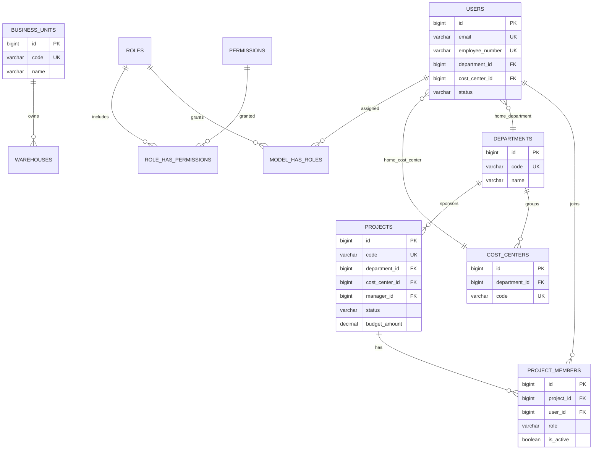
```mermaid
erDiagram
    BUSINESS_UNITS ||--o{ WAREHOUSES : owns
    DEPARTMENTS ||--o{ COST_CENTERS : groups
    DEPARTMENTS ||--o{ PROJECTS : sponsors
    PROJECTS ||--o{ PROJECT_MEMBERS : has
    USERS ||--o{ PROJECT_MEMBERS : joins
    USERS }o--|| DEPARTMENTS : home_department
    USERS }o--|| COST_CENTERS : home_cost_center
    USERS ||--o{ MODEL_HAS_ROLES : assigned
    ROLES ||--o{ MODEL_HAS_ROLES : grants
    ROLES ||--o{ ROLE_HAS_PERMISSIONS : includes
    PERMISSIONS ||--o{ ROLE_HAS_PERMISSIONS : granted

    BUSINESS_UNITS {
      bigint id PK
      varchar code UK
      varchar name
    }
    DEPARTMENTS {
      bigint id PK
      varchar code UK
      varchar name
    }
    COST_CENTERS {
      bigint id PK
      bigint department_id FK
      varchar code UK
    }
    PROJECTS {
      bigint id PK
      varchar code UK
      bigint department_id FK
      bigint cost_center_id FK
      bigint manager_id FK
      varchar status
      decimal budget_amount
    }
    PROJECT_MEMBERS {
      bigint id PK
      bigint project_id FK
      bigint user_id FK
      varchar role
      boolean is_active
    }
    USERS {
      bigint id PK
      varchar email UK
      varchar employee_number UK
      bigint department_id FK
      bigint cost_center_id FK
      varchar status
    }
```

## 2. Warehouse management

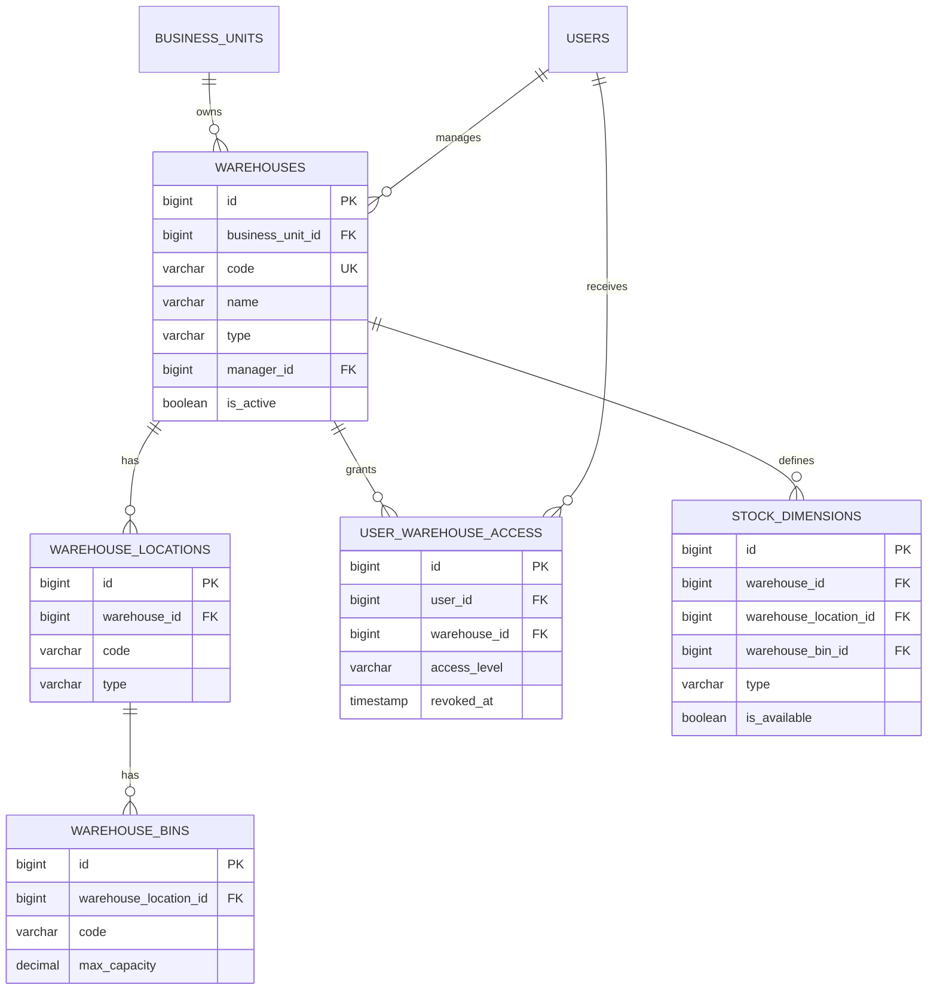
```mermaid
erDiagram
    BUSINESS_UNITS ||--o{ WAREHOUSES : owns
    USERS ||--o{ WAREHOUSES : manages
    WAREHOUSES ||--o{ WAREHOUSE_LOCATIONS : has
    WAREHOUSE_LOCATIONS ||--o{ WAREHOUSE_BINS : has
    WAREHOUSES ||--o{ USER_WAREHOUSE_ACCESS : grants
    USERS ||--o{ USER_WAREHOUSE_ACCESS : receives
    WAREHOUSES ||--o{ STOCK_DIMENSIONS : defines

    WAREHOUSES {
      bigint id PK
      bigint business_unit_id FK
      varchar code UK
      varchar name
      varchar type
      bigint manager_id FK
      boolean is_active
    }
    WAREHOUSE_LOCATIONS {
      bigint id PK
      bigint warehouse_id FK
      varchar code
      varchar type
    }
    WAREHOUSE_BINS {
      bigint id PK
      bigint warehouse_location_id FK
      varchar code
      decimal max_capacity
    }
    USER_WAREHOUSE_ACCESS {
      bigint id PK
      bigint user_id FK
      bigint warehouse_id FK
      varchar access_level
      timestamp revoked_at
    }
    STOCK_DIMENSIONS {
      bigint id PK
      bigint warehouse_id FK
      bigint warehouse_location_id FK
      bigint warehouse_bin_id FK
      varchar type
      boolean is_available
    }
```

## 3. Item master and classification

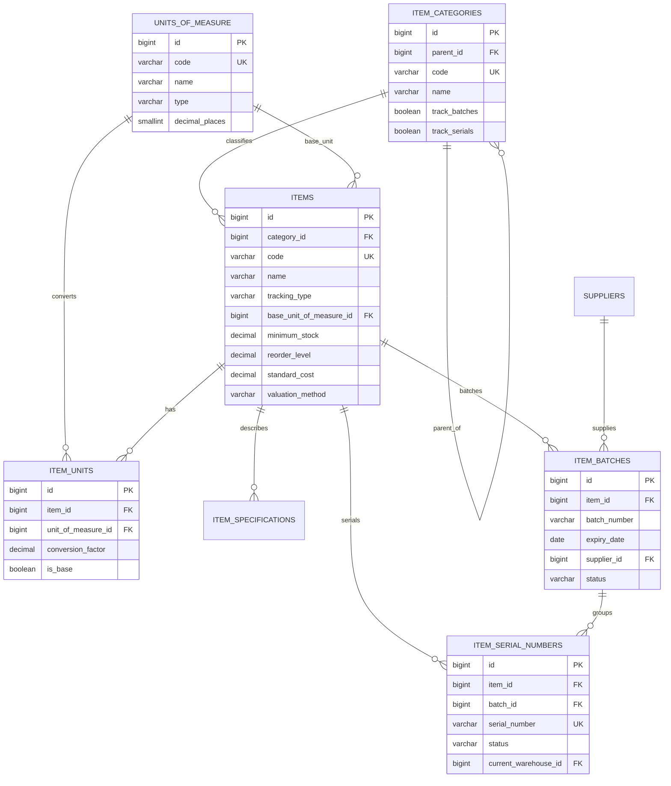
```mermaid
erDiagram
    ITEM_CATEGORIES ||--o{ ITEM_CATEGORIES : parent_of
    ITEM_CATEGORIES ||--o{ ITEMS : classifies
    UNITS_OF_MEASURE ||--o{ ITEMS : base_unit
    UNITS_OF_MEASURE ||--o{ ITEM_UNITS : converts
    ITEMS ||--o{ ITEM_UNITS : has
    ITEMS ||--o{ ITEM_SPECIFICATIONS : describes
    ITEMS ||--o{ ITEM_BATCHES : batches
    ITEMS ||--o{ ITEM_SERIAL_NUMBERS : serials
    ITEM_BATCHES ||--o{ ITEM_SERIAL_NUMBERS : groups
    SUPPLIERS ||--o{ ITEM_BATCHES : supplies

    ITEM_CATEGORIES {
      bigint id PK
      bigint parent_id FK
      varchar code UK
      varchar name
      boolean track_batches
      boolean track_serials
    }
    UNITS_OF_MEASURE {
      bigint id PK
      varchar code UK
      varchar name
      varchar type
      smallint decimal_places
    }
    ITEMS {
      bigint id PK
      bigint category_id FK
      varchar code UK
      varchar name
      varchar tracking_type
      bigint base_unit_of_measure_id FK
      decimal minimum_stock
      decimal reorder_level
      decimal standard_cost
      varchar valuation_method
    }
    ITEM_UNITS {
      bigint id PK
      bigint item_id FK
      bigint unit_of_measure_id FK
      decimal conversion_factor
      boolean is_base
    }
    ITEM_BATCHES {
      bigint id PK
      bigint item_id FK
      varchar batch_number
      date expiry_date
      bigint supplier_id FK
      varchar status
    }
    ITEM_SERIAL_NUMBERS {
      bigint id PK
      bigint item_id FK
      bigint batch_id FK
      varchar serial_number UK
      varchar status
      bigint current_warehouse_id FK
    }
```

## 4. Supplier management

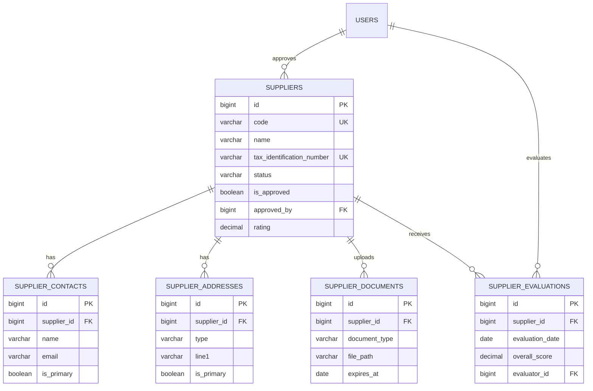
```mermaid
erDiagram
    SUPPLIERS ||--o{ SUPPLIER_CONTACTS : has
    SUPPLIERS ||--o{ SUPPLIER_ADDRESSES : has
    SUPPLIERS ||--o{ SUPPLIER_DOCUMENTS : uploads
    SUPPLIERS ||--o{ SUPPLIER_EVALUATIONS : receives
    USERS ||--o{ SUPPLIERS : approves
    USERS ||--o{ SUPPLIER_EVALUATIONS : evaluates

    SUPPLIERS {
      bigint id PK
      varchar code UK
      varchar name
      varchar tax_identification_number UK
      varchar status
      boolean is_approved
      bigint approved_by FK
      decimal rating
    }
    SUPPLIER_CONTACTS {
      bigint id PK
      bigint supplier_id FK
      varchar name
      varchar email
      boolean is_primary
    }
    SUPPLIER_ADDRESSES {
      bigint id PK
      bigint supplier_id FK
      varchar type
      varchar line1
      boolean is_primary
    }
    SUPPLIER_DOCUMENTS {
      bigint id PK
      bigint supplier_id FK
      varchar document_type
      varchar file_path
      date expires_at
    }
    SUPPLIER_EVALUATIONS {
      bigint id PK
      bigint supplier_id FK
      date evaluation_date
      decimal overall_score
      bigint evaluator_id FK
    }
```

## 5. Procurement

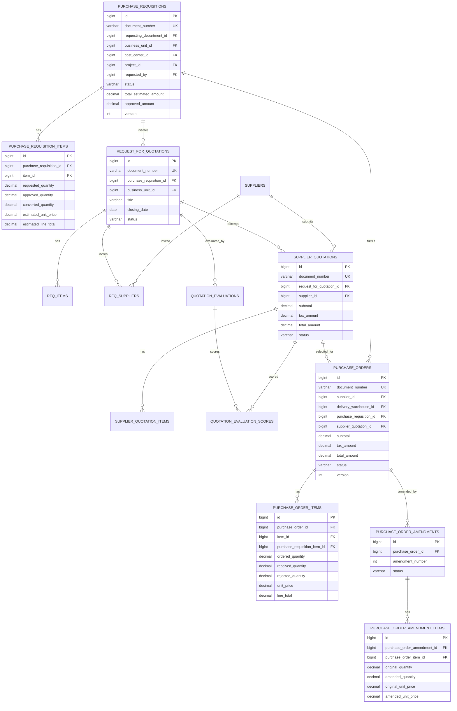
```mermaid
erDiagram
    PURCHASE_REQUISITIONS ||--o{ PURCHASE_REQUISITION_ITEMS : has
    PURCHASE_REQUISITIONS ||--o{ REQUEST_FOR_QUOTATIONS : initiates
    REQUEST_FOR_QUOTATIONS ||--o{ RFQ_ITEMS : has
    REQUEST_FOR_QUOTATIONS ||--o{ RFQ_SUPPLIERS : invites
    SUPPLIERS ||--o{ RFQ_SUPPLIERS : invited
    REQUEST_FOR_QUOTATIONS ||--o{ SUPPLIER_QUOTATIONS : receives
    SUPPLIERS ||--o{ SUPPLIER_QUOTATIONS : submits
    SUPPLIER_QUOTATIONS ||--o{ SUPPLIER_QUOTATION_ITEMS : has
    REQUEST_FOR_QUOTATIONS ||--o{ QUOTATION_EVALUATIONS : evaluated_by
    QUOTATION_EVALUATIONS ||--o{ QUOTATION_EVALUATION_SCORES : scores
    SUPPLIER_QUOTATIONS ||--o{ QUOTATION_EVALUATION_SCORES : scored
    SUPPLIER_QUOTATIONS ||--o{ PURCHASE_ORDERS : selected_for
    PURCHASE_REQUISITIONS ||--o{ PURCHASE_ORDERS : fulfills
    PURCHASE_ORDERS ||--o{ PURCHASE_ORDER_ITEMS : has
    PURCHASE_ORDERS ||--o{ PURCHASE_ORDER_AMENDMENTS : amended_by
    PURCHASE_ORDER_AMENDMENTS ||--o{ PURCHASE_ORDER_AMENDMENT_ITEMS : has

    PURCHASE_REQUISITIONS {
      bigint id PK
      varchar document_number UK
      bigint requesting_department_id FK
      bigint business_unit_id FK
      bigint cost_center_id FK
      bigint project_id FK
      bigint requested_by FK
      varchar status
      decimal total_estimated_amount
      decimal approved_amount
      int version
    }
    PURCHASE_REQUISITION_ITEMS {
      bigint id PK
      bigint purchase_requisition_id FK
      bigint item_id FK
      decimal requested_quantity
      decimal approved_quantity
      decimal converted_quantity
      decimal estimated_unit_price
      decimal estimated_line_total
    }
    REQUEST_FOR_QUOTATIONS {
      bigint id PK
      varchar document_number UK
      bigint purchase_requisition_id FK
      bigint business_unit_id FK
      varchar title
      date closing_date
      varchar status
    }
    SUPPLIER_QUOTATIONS {
      bigint id PK
      varchar document_number UK
      bigint request_for_quotation_id FK
      bigint supplier_id FK
      decimal subtotal
      decimal tax_amount
      decimal total_amount
      varchar status
    }
    PURCHASE_ORDERS {
      bigint id PK
      varchar document_number UK
      bigint supplier_id FK
      bigint delivery_warehouse_id FK
      bigint purchase_requisition_id FK
      bigint supplier_quotation_id FK
      decimal subtotal
      decimal tax_amount
      decimal total_amount
      varchar status
      int version
    }
    PURCHASE_ORDER_ITEMS {
      bigint id PK
      bigint purchase_order_id FK
      bigint item_id FK
      bigint purchase_requisition_item_id FK
      decimal ordered_quantity
      decimal received_quantity
      decimal rejected_quantity
      decimal unit_price
      decimal line_total
    }
    PURCHASE_ORDER_AMENDMENTS {
      bigint id PK
      bigint purchase_order_id FK
      int amendment_number
      varchar status
    }
    PURCHASE_ORDER_AMENDMENT_ITEMS {
      bigint id PK
      bigint purchase_order_amendment_id FK
      bigint purchase_order_item_id FK
      decimal original_quantity
      decimal amended_quantity
      decimal original_unit_price
      decimal amended_unit_price
    }
```

## 6. Receiving and quality inspection

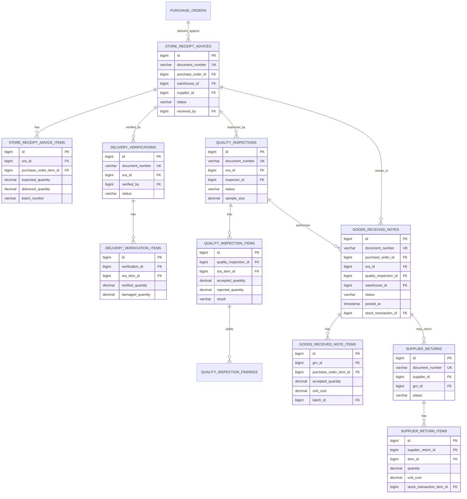
```mermaid
erDiagram
    PURCHASE_ORDERS ||--o{ STORE_RECEIPT_ADVICES : delivers_against
    STORE_RECEIPT_ADVICES ||--o{ STORE_RECEIPT_ADVICE_ITEMS : has
    STORE_RECEIPT_ADVICES ||--o{ DELIVERY_VERIFICATIONS : verified_by
    DELIVERY_VERIFICATIONS ||--o{ DELIVERY_VERIFICATION_ITEMS : has
    STORE_RECEIPT_ADVICES ||--o{ QUALITY_INSPECTIONS : inspected_by
    QUALITY_INSPECTIONS ||--o{ QUALITY_INSPECTION_ITEMS : has
    QUALITY_INSPECTION_ITEMS ||--o{ QUALITY_INSPECTION_FINDINGS : yields
    STORE_RECEIPT_ADVICES ||--o{ GOODS_RECEIVED_NOTES : results_in
    QUALITY_INSPECTIONS ||--o{ GOODS_RECEIVED_NOTES : authorizes
    GOODS_RECEIVED_NOTES ||--o{ GOODS_RECEIVED_NOTE_ITEMS : has
    GOODS_RECEIVED_NOTES ||--o{ SUPPLIER_RETURNS : may_return
    SUPPLIER_RETURNS ||--o{ SUPPLIER_RETURN_ITEMS : has

    STORE_RECEIPT_ADVICES {
      bigint id PK
      varchar document_number UK
      bigint purchase_order_id FK
      bigint warehouse_id FK
      bigint supplier_id FK
      varchar status
      bigint received_by FK
    }
    DELIVERY_VERIFICATIONS {
      bigint id PK
      varchar document_number UK
      bigint sra_id FK
      bigint verified_by FK
      varchar status
    }
    QUALITY_INSPECTIONS {
      bigint id PK
      varchar document_number UK
      bigint sra_id FK
      bigint inspector_id FK
      varchar status
      decimal sample_size
    }
    QUALITY_INSPECTION_ITEMS {
      bigint id PK
      bigint quality_inspection_id FK
      bigint sra_item_id FK
      decimal accepted_quantity
      decimal rejected_quantity
      varchar result
    }
    GOODS_RECEIVED_NOTES {
      bigint id PK
      varchar document_number UK
      bigint purchase_order_id FK
      bigint sra_id FK
      bigint quality_inspection_id FK
      bigint warehouse_id FK
      varchar status
      timestamp posted_at
      bigint stock_transaction_id FK
    }
    GOODS_RECEIVED_NOTE_ITEMS {
      bigint id PK
      bigint grn_id FK
      bigint purchase_order_item_id FK
      decimal accepted_quantity
      decimal unit_cost
      bigint batch_id FK
    }
    SUPPLIER_RETURNS {
      bigint id PK
      varchar document_number UK
      bigint supplier_id FK
      bigint grn_id FK
      varchar status
    }
    SUPPLIER_RETURN_ITEMS {
      bigint id PK
      bigint supplier_return_id FK
      bigint item_id FK
      decimal quantity
      decimal unit_cost
      bigint stock_transaction_item_id FK
    }
    DELIVERY_VERIFICATION_ITEMS {
      bigint id PK
      bigint verification_id FK
      bigint sra_item_id FK
      decimal verified_quantity
      decimal damaged_quantity
    }
    STORE_RECEIPT_ADVICE_ITEMS {
      bigint id PK
      bigint sra_id FK
      bigint purchase_order_item_id FK
      decimal expected_quantity
      decimal delivered_quantity
      varchar batch_number
    }
```

## 7. Inventory and stock ledger

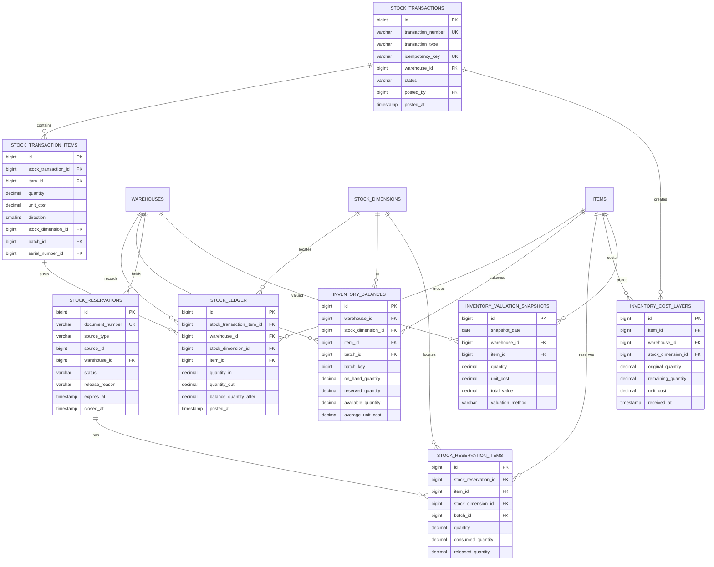
```mermaid
erDiagram
    STOCK_TRANSACTIONS ||--o{ STOCK_TRANSACTION_ITEMS : contains
    STOCK_TRANSACTION_ITEMS ||--o{ STOCK_LEDGER : posts
    WAREHOUSES ||--o{ STOCK_LEDGER : records
    STOCK_DIMENSIONS ||--o{ STOCK_LEDGER : locates
    ITEMS ||--o{ STOCK_LEDGER : moves
    ITEMS ||--o{ INVENTORY_BALANCES : balances
    WAREHOUSES ||--o{ INVENTORY_BALANCES : holds
    STOCK_DIMENSIONS ||--o{ INVENTORY_BALANCES : at
    STOCK_RESERVATIONS ||--o{ STOCK_RESERVATION_ITEMS : has
    WAREHOUSES ||--o{ STOCK_RESERVATIONS : holds
    ITEMS ||--o{ STOCK_RESERVATION_ITEMS : reserves
    STOCK_DIMENSIONS ||--o{ STOCK_RESERVATION_ITEMS : locates
    ITEMS ||--o{ INVENTORY_COST_LAYERS : costs
    STOCK_TRANSACTIONS ||--o{ INVENTORY_COST_LAYERS : creates
    WAREHOUSES ||--o{ INVENTORY_VALUATION_SNAPSHOTS : valued
    ITEMS ||--o{ INVENTORY_VALUATION_SNAPSHOTS : priced

    STOCK_TRANSACTIONS {
      bigint id PK
      varchar transaction_number UK
      varchar transaction_type
      varchar idempotency_key UK
      bigint warehouse_id FK
      varchar status
      bigint posted_by FK
      timestamp posted_at
    }
    STOCK_TRANSACTION_ITEMS {
      bigint id PK
      bigint stock_transaction_id FK
      bigint item_id FK
      decimal quantity
      decimal unit_cost
      smallint direction
      bigint stock_dimension_id FK
      bigint batch_id FK
      bigint serial_number_id FK
    }
    STOCK_LEDGER {
      bigint id PK
      bigint stock_transaction_item_id FK
      bigint warehouse_id FK
      bigint stock_dimension_id FK
      bigint item_id FK
      decimal quantity_in
      decimal quantity_out
      decimal balance_quantity_after
      timestamp posted_at
    }
    INVENTORY_BALANCES {
      bigint id PK
      bigint warehouse_id FK
      bigint stock_dimension_id FK
      bigint item_id FK
      bigint batch_id FK
      bigint batch_key
      decimal on_hand_quantity
      decimal reserved_quantity
      decimal available_quantity
      decimal average_unit_cost
    }
    STOCK_RESERVATIONS {
      bigint id PK
      varchar document_number UK
      varchar source_type
      bigint source_id
      bigint warehouse_id FK
      varchar status
      varchar release_reason
      timestamp expires_at
      timestamp closed_at
    }
    STOCK_RESERVATION_ITEMS {
      bigint id PK
      bigint stock_reservation_id FK
      bigint item_id FK
      bigint stock_dimension_id FK
      bigint batch_id FK
      decimal quantity
      decimal consumed_quantity
      decimal released_quantity
    }
    INVENTORY_VALUATION_SNAPSHOTS {
      bigint id PK
      date snapshot_date
      bigint warehouse_id FK
      bigint item_id FK
      decimal quantity
      decimal unit_cost
      decimal total_value
      varchar valuation_method
    }
    INVENTORY_COST_LAYERS {
      bigint id PK
      bigint item_id FK
      bigint warehouse_id FK
      bigint stock_dimension_id FK
      decimal original_quantity
      decimal remaining_quantity
      decimal unit_cost
      timestamp received_at
    }
```

## 8. Material requisition and issuance (Phase 6, implemented)

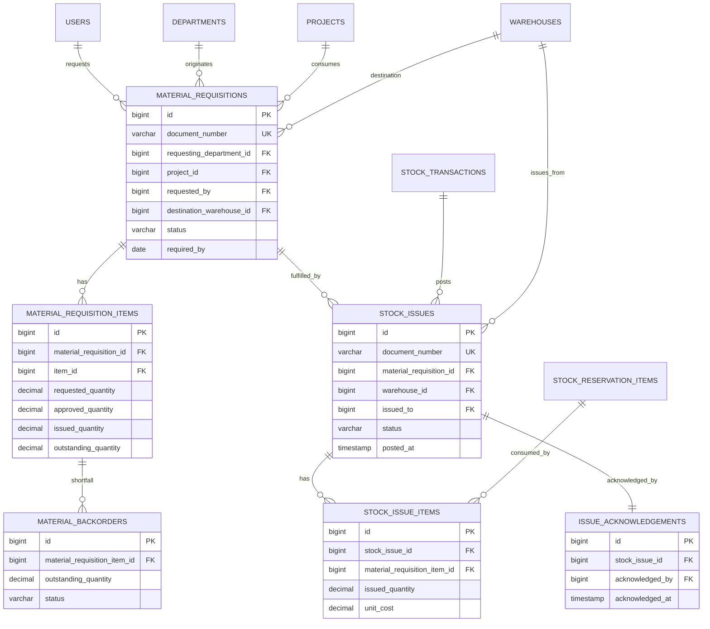
```mermaid
erDiagram
    MATERIAL_REQUISITIONS ||--o{ MATERIAL_REQUISITION_ITEMS : has
    MATERIAL_REQUISITIONS ||--o{ STOCK_ISSUES : fulfilled_by
    STOCK_ISSUES ||--o{ STOCK_ISSUE_ITEMS : has
    STOCK_ISSUES ||--|| ISSUE_ACKNOWLEDGEMENTS : acknowledged_by
    MATERIAL_REQUISITION_ITEMS ||--o{ MATERIAL_BACKORDERS : shortfall
    STOCK_RESERVATION_ITEMS ||--o{ STOCK_ISSUE_ITEMS : consumed_by
    STOCK_TRANSACTIONS ||--o{ STOCK_ISSUES : posts
    USERS ||--o{ MATERIAL_REQUISITIONS : requests
    DEPARTMENTS ||--o{ MATERIAL_REQUISITIONS : originates
    PROJECTS ||--o{ MATERIAL_REQUISITIONS : consumes
    WAREHOUSES ||--o{ MATERIAL_REQUISITIONS : destination
    WAREHOUSES ||--o{ STOCK_ISSUES : issues_from

    MATERIAL_REQUISITIONS {
      bigint id PK
      varchar document_number UK
      bigint requesting_department_id FK
      bigint project_id FK
      bigint requested_by FK
      bigint destination_warehouse_id FK
      varchar status
      date required_by
    }
    MATERIAL_REQUISITION_ITEMS {
      bigint id PK
      bigint material_requisition_id FK
      bigint item_id FK
      decimal requested_quantity
      decimal approved_quantity
      decimal issued_quantity
      decimal outstanding_quantity
    }
    STOCK_ISSUES {
      bigint id PK
      varchar document_number UK
      bigint material_requisition_id FK
      bigint warehouse_id FK
      bigint issued_to FK
      varchar status
      timestamp posted_at
    }
    STOCK_ISSUE_ITEMS {
      bigint id PK
      bigint stock_issue_id FK
      bigint material_requisition_item_id FK
      decimal issued_quantity
      decimal unit_cost
    }
    ISSUE_ACKNOWLEDGEMENTS {
      bigint id PK
      bigint stock_issue_id FK
      bigint acknowledged_by FK
      timestamp acknowledged_at
    }
    MATERIAL_BACKORDERS {
      bigint id PK
      bigint material_requisition_item_id FK
      decimal outstanding_quantity
      varchar status
    }
```

## 9. Inter-warehouse transfers (Phase 6, implemented)

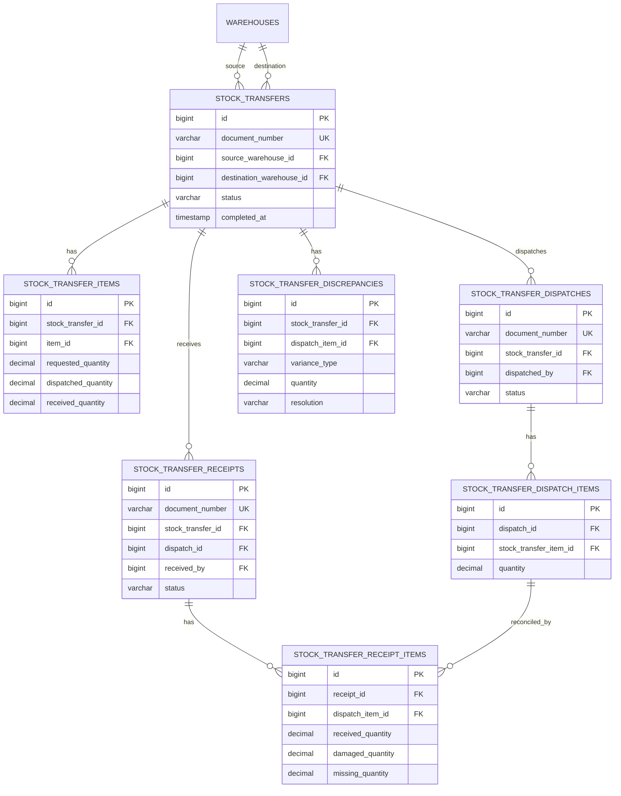
```mermaid
erDiagram
    STOCK_TRANSFERS ||--o{ STOCK_TRANSFER_ITEMS : has
    STOCK_TRANSFERS ||--o{ STOCK_TRANSFER_DISPATCHES : dispatches
    STOCK_TRANSFER_DISPATCHES ||--o{ STOCK_TRANSFER_DISPATCH_ITEMS : has
    STOCK_TRANSFERS ||--o{ STOCK_TRANSFER_RECEIPTS : receives
    STOCK_TRANSFER_RECEIPTS ||--o{ STOCK_TRANSFER_RECEIPT_ITEMS : has
    STOCK_TRANSFER_DISPATCH_ITEMS ||--o{ STOCK_TRANSFER_RECEIPT_ITEMS : reconciled_by
    STOCK_TRANSFERS ||--o{ STOCK_TRANSFER_DISCREPANCIES : has
    WAREHOUSES ||--o{ STOCK_TRANSFERS : source
    WAREHOUSES ||--o{ STOCK_TRANSFERS : destination

    STOCK_TRANSFERS {
      bigint id PK
      varchar document_number UK
      bigint source_warehouse_id FK
      bigint destination_warehouse_id FK
      varchar status
      timestamp completed_at
    }
    STOCK_TRANSFER_ITEMS {
      bigint id PK
      bigint stock_transfer_id FK
      bigint item_id FK
      decimal requested_quantity
      decimal dispatched_quantity
      decimal received_quantity
    }
    STOCK_TRANSFER_DISPATCHES {
      bigint id PK
      varchar document_number UK
      bigint stock_transfer_id FK
      bigint dispatched_by FK
      varchar status
    }
    STOCK_TRANSFER_DISPATCH_ITEMS {
      bigint id PK
      bigint dispatch_id FK
      bigint stock_transfer_item_id FK
      decimal quantity
    }
    STOCK_TRANSFER_RECEIPTS {
      bigint id PK
      varchar document_number UK
      bigint stock_transfer_id FK
      bigint dispatch_id FK
      bigint received_by FK
      varchar status
    }
    STOCK_TRANSFER_RECEIPT_ITEMS {
      bigint id PK
      bigint receipt_id FK
      bigint dispatch_item_id FK
      decimal received_quantity
      decimal damaged_quantity
      decimal missing_quantity
    }
    STOCK_TRANSFER_DISCREPANCIES {
      bigint id PK
      bigint stock_transfer_id FK
      bigint dispatch_item_id FK
      varchar variance_type
      decimal quantity
      varchar resolution
    }
```

## 10. Returns and adjustments (Phase 6 returns and Phase 7 adjustments implemented)

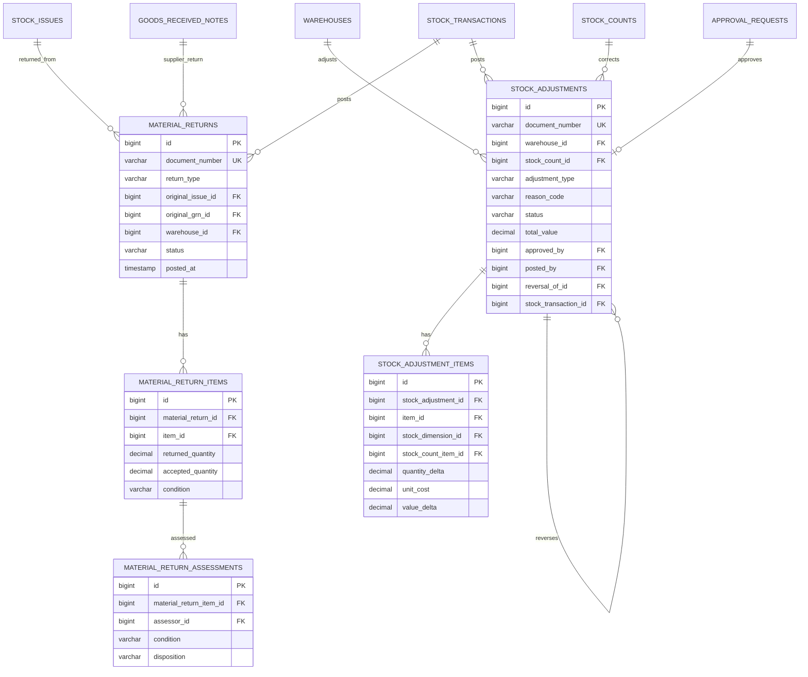
```mermaid
erDiagram
    STOCK_ISSUES ||--o{ MATERIAL_RETURNS : returned_from
    GOODS_RECEIVED_NOTES ||--o{ MATERIAL_RETURNS : supplier_return
    MATERIAL_RETURNS ||--o{ MATERIAL_RETURN_ITEMS : has
    MATERIAL_RETURN_ITEMS ||--o{ MATERIAL_RETURN_ASSESSMENTS : assessed
    STOCK_TRANSACTIONS ||--o{ MATERIAL_RETURNS : posts
    STOCK_ADJUSTMENTS ||--o{ STOCK_ADJUSTMENT_ITEMS : has
    WAREHOUSES ||--o{ STOCK_ADJUSTMENTS : adjusts
    STOCK_COUNTS ||--o{ STOCK_ADJUSTMENTS : corrects
    STOCK_ADJUSTMENTS ||--o{ STOCK_ADJUSTMENTS : reverses
    STOCK_TRANSACTIONS ||--o{ STOCK_ADJUSTMENTS : posts
    APPROVAL_REQUESTS ||--o| STOCK_ADJUSTMENTS : approves

    MATERIAL_RETURNS {
      bigint id PK
      varchar document_number UK
      varchar return_type
      bigint original_issue_id FK
      bigint original_grn_id FK
      bigint warehouse_id FK
      varchar status
      timestamp posted_at
    }
    MATERIAL_RETURN_ITEMS {
      bigint id PK
      bigint material_return_id FK
      bigint item_id FK
      decimal returned_quantity
      decimal accepted_quantity
      varchar condition
    }
    MATERIAL_RETURN_ASSESSMENTS {
      bigint id PK
      bigint material_return_item_id FK
      bigint assessor_id FK
      varchar condition
      varchar disposition
    }
    STOCK_ADJUSTMENTS {
      bigint id PK
      varchar document_number UK
      bigint warehouse_id FK
      bigint stock_count_id FK
      varchar adjustment_type
      varchar reason_code
      varchar status
      decimal total_value
      bigint approved_by FK
      bigint posted_by FK
      bigint reversal_of_id FK
      bigint stock_transaction_id FK
    }
    STOCK_ADJUSTMENT_ITEMS {
      bigint id PK
      bigint stock_adjustment_id FK
      bigint item_id FK
      bigint stock_dimension_id FK
      bigint stock_count_item_id FK
      decimal quantity_delta
      decimal unit_cost
      decimal value_delta
    }
```

## 11. Stocktaking and reconciliation (Phase 7 implemented)

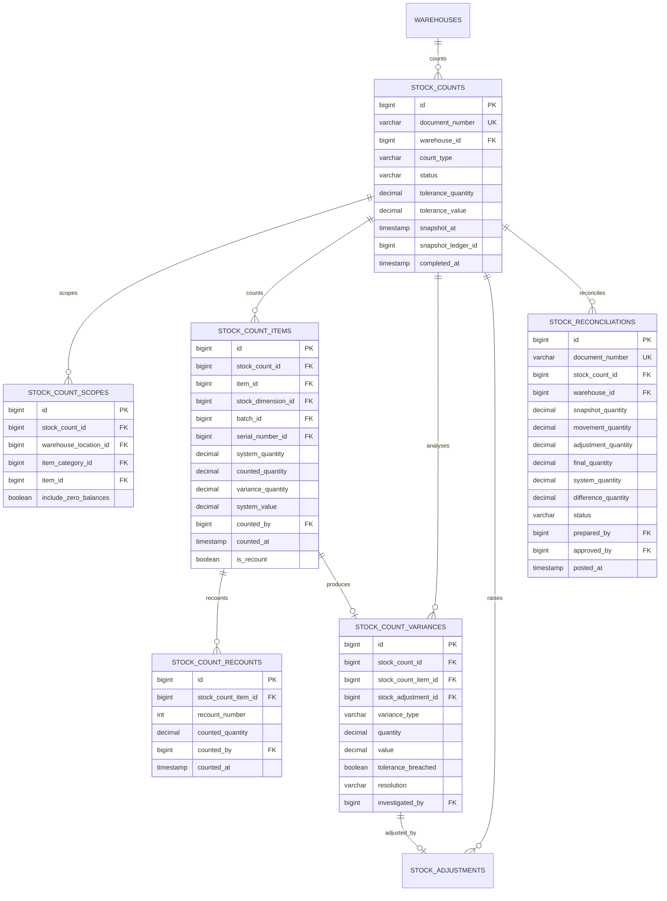
```mermaid
erDiagram
    STOCK_COUNTS ||--o{ STOCK_COUNT_SCOPES : scopes
    STOCK_COUNTS ||--o{ STOCK_COUNT_ITEMS : counts
    STOCK_COUNT_ITEMS ||--o{ STOCK_COUNT_RECOUNTS : recounts
    STOCK_COUNTS ||--o{ STOCK_COUNT_VARIANCES : analyses
    STOCK_COUNT_ITEMS ||--o| STOCK_COUNT_VARIANCES : produces
    STOCK_COUNT_VARIANCES ||--o| STOCK_ADJUSTMENTS : adjusted_by
    STOCK_COUNTS ||--o{ STOCK_ADJUSTMENTS : raises
    STOCK_COUNTS ||--o{ STOCK_RECONCILIATIONS : reconciles
    WAREHOUSES ||--o{ STOCK_COUNTS : counts

    STOCK_COUNTS {
      bigint id PK
      varchar document_number UK
      bigint warehouse_id FK
      varchar count_type
      varchar status
      decimal tolerance_quantity
      decimal tolerance_value
      timestamp snapshot_at
      bigint snapshot_ledger_id
      timestamp completed_at
    }
    STOCK_COUNT_SCOPES {
      bigint id PK
      bigint stock_count_id FK
      bigint warehouse_location_id FK
      bigint item_category_id FK
      bigint item_id FK
      boolean include_zero_balances
    }
    STOCK_COUNT_ITEMS {
      bigint id PK
      bigint stock_count_id FK
      bigint item_id FK
      bigint stock_dimension_id FK
      bigint batch_id FK
      bigint serial_number_id FK
      decimal system_quantity
      decimal counted_quantity
      decimal variance_quantity
      decimal system_value
      bigint counted_by FK
      timestamp counted_at
      boolean is_recount
    }
    STOCK_COUNT_RECOUNTS {
      bigint id PK
      bigint stock_count_item_id FK
      int recount_number
      decimal counted_quantity
      bigint counted_by FK
      timestamp counted_at
    }
    STOCK_COUNT_VARIANCES {
      bigint id PK
      bigint stock_count_id FK
      bigint stock_count_item_id FK
      bigint stock_adjustment_id FK
      varchar variance_type
      decimal quantity
      decimal value
      boolean tolerance_breached
      varchar resolution
      bigint investigated_by FK
    }
    STOCK_RECONCILIATIONS {
      bigint id PK
      varchar document_number UK
      bigint stock_count_id FK
      bigint warehouse_id FK
      decimal snapshot_quantity
      decimal movement_quantity
      decimal adjustment_quantity
      decimal final_quantity
      decimal system_quantity
      decimal difference_quantity
      varchar status
      bigint prepared_by FK
      bigint approved_by FK
      timestamp posted_at
    }
```

## 12. Approval workflow

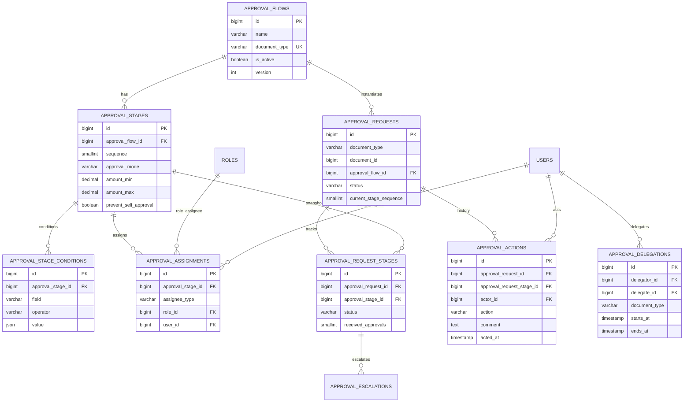
```mermaid
erDiagram
    APPROVAL_FLOWS ||--o{ APPROVAL_STAGES : has
    APPROVAL_STAGES ||--o{ APPROVAL_STAGE_CONDITIONS : conditions
    APPROVAL_STAGES ||--o{ APPROVAL_ASSIGNMENTS : assigns
    ROLES ||--o{ APPROVAL_ASSIGNMENTS : role_assignee
    USERS ||--o{ APPROVAL_ASSIGNMENTS : user_assignee
    APPROVAL_FLOWS ||--o{ APPROVAL_REQUESTS : instantiates
    APPROVAL_REQUESTS ||--o{ APPROVAL_REQUEST_STAGES : tracks
    APPROVAL_STAGES ||--o{ APPROVAL_REQUEST_STAGES : snapshot
    APPROVAL_REQUESTS ||--o{ APPROVAL_ACTIONS : history
    USERS ||--o{ APPROVAL_ACTIONS : acts
    USERS ||--o{ APPROVAL_DELEGATIONS : delegates
    APPROVAL_REQUEST_STAGES ||--o{ APPROVAL_ESCALATIONS : escalates

    APPROVAL_FLOWS {
      bigint id PK
      varchar name
      varchar document_type UK
      boolean is_active
      int version
    }
    APPROVAL_STAGES {
      bigint id PK
      bigint approval_flow_id FK
      smallint sequence
      varchar approval_mode
      decimal amount_min
      decimal amount_max
      boolean prevent_self_approval
    }
    APPROVAL_STAGE_CONDITIONS {
      bigint id PK
      bigint approval_stage_id FK
      varchar field
      varchar operator
      json value
    }
    APPROVAL_ASSIGNMENTS {
      bigint id PK
      bigint approval_stage_id FK
      varchar assignee_type
      bigint role_id FK
      bigint user_id FK
    }
    APPROVAL_REQUESTS {
      bigint id PK
      varchar document_type
      bigint document_id
      bigint approval_flow_id FK
      varchar status
      smallint current_stage_sequence
    }
    APPROVAL_REQUEST_STAGES {
      bigint id PK
      bigint approval_request_id FK
      bigint approval_stage_id FK
      varchar status
      smallint received_approvals
    }
    APPROVAL_ACTIONS {
      bigint id PK
      bigint approval_request_id FK
      bigint approval_request_stage_id FK
      bigint actor_id FK
      varchar action
      text comment
      timestamp acted_at
    }
    APPROVAL_DELEGATIONS {
      bigint id PK
      bigint delegator_id FK
      bigint delegate_id FK
      varchar document_type
      timestamp starts_at
      timestamp ends_at
    }
```

## 13. Documents, audit, integration

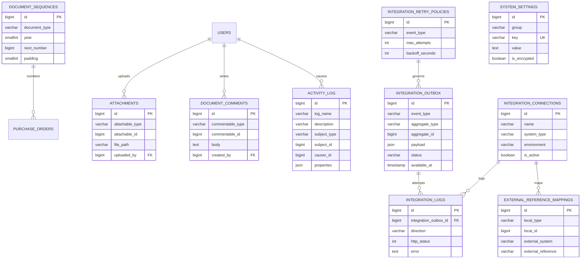
```mermaid
erDiagram
    DOCUMENT_SEQUENCES ||--o{ PURCHASE_ORDERS : numbers
    USERS ||--o{ ATTACHMENTS : uploads
    USERS ||--o{ DOCUMENT_COMMENTS : writes
    USERS ||--o{ ACTIVITY_LOG : causes
    INTEGRATION_CONNECTIONS ||--o{ INTEGRATION_LOGS : logs
    INTEGRATION_OUTBOX ||--o{ INTEGRATION_LOGS : attempts
    INTEGRATION_RETRY_POLICIES ||--o{ INTEGRATION_OUTBOX : governs
    INTEGRATION_CONNECTIONS ||--o{ EXTERNAL_REFERENCE_MAPPINGS : maps

    DOCUMENT_SEQUENCES {
      bigint id PK
      varchar document_type
      smallint year
      bigint next_number
      smallint padding
    }
    ATTACHMENTS {
      bigint id PK
      varchar attachable_type
      bigint attachable_id
      varchar file_path
      bigint uploaded_by FK
    }
    DOCUMENT_COMMENTS {
      bigint id PK
      varchar commentable_type
      bigint commentable_id
      text body
      bigint created_by FK
    }
    ACTIVITY_LOG {
      bigint id PK
      varchar log_name
      varchar description
      varchar subject_type
      bigint subject_id
      bigint causer_id
      json properties
    }
    SYSTEM_SETTINGS {
      bigint id PK
      varchar group
      varchar key UK
      text value
      boolean is_encrypted
    }
    INTEGRATION_CONNECTIONS {
      bigint id PK
      varchar name
      varchar system_type
      varchar environment
      boolean is_active
    }
    EXTERNAL_REFERENCE_MAPPINGS {
      bigint id PK
      varchar local_type
      bigint local_id
      varchar external_system
      varchar external_reference
    }
    INTEGRATION_OUTBOX {
      bigint id PK
      varchar event_type
      varchar aggregate_type
      bigint aggregate_id
      json payload
      varchar status
      timestamp available_at
    }
    INTEGRATION_LOGS {
      bigint id PK
      bigint integration_outbox_id FK
      varchar direction
      int http_status
      text error
    }
    INTEGRATION_RETRY_POLICIES {
      bigint id PK
      varchar event_type
      int max_attempts
      int backoff_seconds
    }
```

## 14. Reporting (Phase 8 implemented)

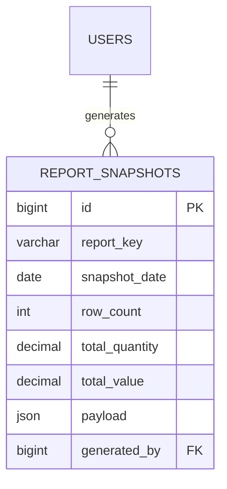
```mermaid
erDiagram
    USERS ||--o{ REPORT_SNAPSHOTS : generates

    REPORT_SNAPSHOTS {
      bigint id PK
      varchar report_key
      date snapshot_date
      int row_count
      decimal total_quantity
      decimal total_value
      json payload
      bigint generated_by FK
    }
```

Reporting reads the existing ledger, balances, procurement, distribution, warehouse and activity tables. `report_snapshots` is the only reporting-owned table and is keyed by `(report_key, snapshot_date)` so a re-run replaces the same day's capture. The dashed conceptual links below are query-only and create no foreign keys:

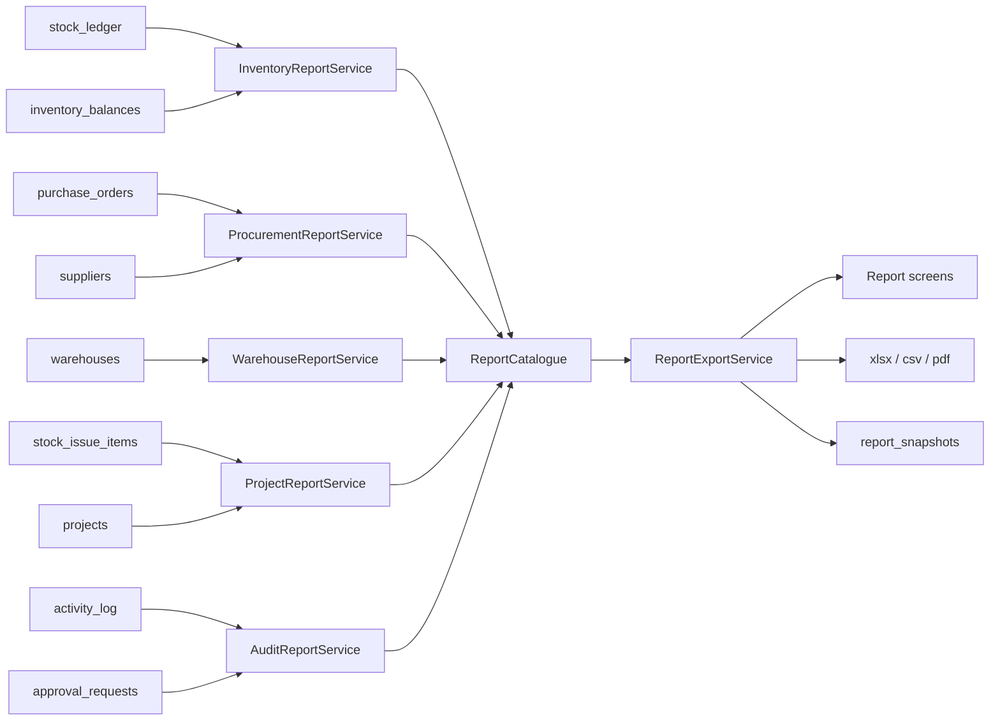
```mermaid
flowchart LR
    LEDGER[stock_ledger] --> INV[InventoryReportService]
    BALANCES[inventory_balances] --> INV
    PO[purchase_orders] --> PROC[ProcurementReportService]
    SUPPLIERS[suppliers] --> PROC
    WAREHOUSES[warehouses] --> WH[WarehouseReportService]
    ISSUES[stock_issue_items] --> PROJ[ProjectReportService]
    PROJECTS[projects] --> PROJ
    ACTIVITY[activity_log] --> AUD[AuditReportService]
    APPROVALS[approval_requests] --> AUD
    INV --> CAT[ReportCatalogue]
    PROC --> CAT
    WH --> CAT
    PROJ --> CAT
    AUD --> CAT
    CAT --> EXP[ReportExportService]
    EXP --> UI[Report screens]
    EXP --> FILES[xlsx / csv / pdf]
    EXP --> SNAP[report_snapshots]
```
